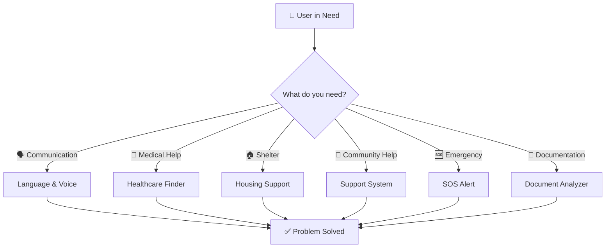
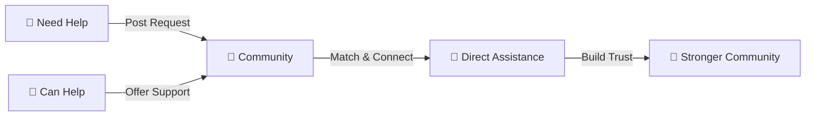

<div align="center">
<svg width="200" height="70" viewBox="0 0 200 70" xmlns="http://www.w3.org/2000/svg">
  <defs>
    <!-- Main gradient -->
    <linearGradient id="mainGradient" x1="0%" y1="0%" x2="100%" y2="100%">
      <stop offset="0%" stop-color="#4a9eff"/>
      <stop offset="50%" stop-color="#7b2ff7"/>
      <stop offset="100%" stop-color="#3d7dd9"/>
    </linearGradient>
    
    <!-- Glow gradient -->
    <radialGradient id="glowGradient" cx="50%" cy="50%" r="50%">
      <stop offset="0%" stop-color="#4a9eff" stop-opacity="0.3"/>
      <stop offset="100%" stop-color="#7b2ff7" stop-opacity="0"/>
    </radialGradient>
    
    <!-- Text gradient -->
    <linearGradient id="textGradient" x1="0%" y1="0%" x2="100%" y2="0%">
      <stop offset="0%" stop-color="#4a9eff"/>
      <stop offset="100%" stop-color="#7b2ff7"/>
    </linearGradient>
    
    <!-- Filter for shadow -->
    <filter id="shadow" x="-50%" y="-50%" width="200%" height="200%">
      <feGaussianBlur in="SourceAlpha" stdDeviation="3"/>
      <feOffset dx="0" dy="2" result="offsetblur"/>
      <feComponentTransfer>
        <feFuncA type="linear" slope="0.3"/>
      </feComponentTransfer>
      <feMerge>
        <feMergeNode/>
        <feMergeNode in="SourceGraphic"/>
      </feMerge>
    </filter>
  </defs>
  
  <!-- Outer glow circles -->
  <circle cx="35" cy="35" r="28" fill="url(#glowGradient)">
    <animate attributeName="r" values="28;32;28" dur="3s" repeatCount="indefinite"/>
    <animate attributeName="opacity" values="0.3;0.5;0.3" dur="3s" repeatCount="indefinite"/>
  </circle>
  
  <!-- Main outer circle with gradient -->
  <circle cx="35" cy="35" r="24" fill="none" stroke="url(#mainGradient)" stroke-width="2" opacity="0.3"/>
  
  <!-- Middle circle -->
  <circle cx="35" cy="35" r="16" fill="url(#mainGradient)" filter="url(#shadow)"/>
  
  <!-- Inner orbiting circles (representing people/connection) -->
  <g>
    <!-- Left person -->
    <circle cx="27" cy="35" r="3" fill="#ffffff" opacity="0.9">
      <animate attributeName="cy" values="35;33;35" dur="2s" repeatCount="indefinite"/>
    </circle>
    
    <!-- Right person -->
    <circle cx="43" cy="35" r="3" fill="#ffffff" opacity="0.9">
      <animate attributeName="cy" values="35;37;35" dur="2s" repeatCount="indefinite"/>
    </circle>
    
    <!-- Connecting line (handshake representation) -->
    <line x1="30" y1="35" x2="40" y2="35" stroke="#ffffff" stroke-width="1.5" opacity="0.8">
      <animate attributeName="opacity" values="0.5;1;0.5" dur="2s" repeatCount="indefinite"/>
    </line>
  </g>
  
  <!-- Center heart/core -->
  <circle cx="35" cy="35" r="4" fill="#ffffff">
    <animate attributeName="r" values="4;5;4" dur="1.5s" repeatCount="indefinite"/>
  </circle>
  
  <!-- Text: Adapto -->
  <text x="75" y="42" font-size="32" font-family="'Poppins', 'Segoe UI', sans-serif" font-weight="700" fill="url(#textGradient)">
    Adapto
  </text>
  
  <!-- Tagline -->
  <text x="76" y="54" font-size="8" font-family="'Poppins', 'Segoe UI', sans-serif" font-weight="400" letter-spacing="2" fill="#64748b" opacity="0.8">
    FOR HUMANITY
  </text>
  
  <!-- Decorative dots -->
  <circle cx="190" cy="20" r="2" fill="url(#mainGradient)" opacity="0.6">
    <animate attributeName="opacity" values="0.3;0.8;0.3" dur="2s" repeatCount="indefinite"/>
  </circle>
  <circle cx="185" cy="28" r="1.5" fill="url(#mainGradient)" opacity="0.5">
    <animate attributeName="opacity" values="0.5;1;0.5" dur="3s" repeatCount="indefinite"/>
  </circle>
</svg>
# 🤝 Adapto

### *Technology That Adapts to Humans*

**A people-first platform designed to help individuals navigate emergencies, migration, disasters, and unfamiliar environments through intelligent, accessible tools.**

[](https://opensource.org/licenses/MIT)
[](https://firebase.google.com/)
[](https://www.openstreetmap.org/)
[](http://makeapullrequest.com)

[🎯 Features](#-features) • [🚀 Getting Started](#-getting-started) • [🧠 Tech Stack](#-tech-stack) • [🗺️ Roadmap](#️-roadmap)

---

</div>

## 🌍 Overview

> **Adapto** bridges the gap between technology and humanity, providing critical support to those who need it most. When someone is displaced, lost, or in crisis, every second counts. Adapto ensures that help is always just one tap away.

<div align="center">

### 📊 Impact At A Glance

| 🌐 Languages | 🏥 Healthcare | 🏠 Housing | 🆘 Emergency |
|:---:|:---:|:---:|:---:|
| **Multi-lingual** | **10km Radius** | **Community-Driven** | **One-Tap SOS** |
| Real-time translation | Map-based search | Peer-to-peer | Live location sharing |

</div>

---

## 🚨 The Problem We're Solving

<table>
<tr>
<td width="50%">

### The Challenges

Every day, **millions of people** face critical barriers:

- 🗣️ **Language barriers** blocking emergency communication
- 🗺️ **Lack of local knowledge** in unfamiliar territories
- 🏥 **Limited access** to healthcare and essential services
- 📞 **No immediate help** during life-threatening situations
- 📄 **Complex documents** in foreign languages
- 🏠 **Nowhere to stay** when displaced or traveling

</td>
<td width="50%">

### Our Approach

**Most solutions are fragmented.** People juggle multiple apps just to survive.

**Adapto is different:**

✅ **Unified Platform** — Everything in one place  
✅ **Accessible** — No expensive APIs or paywalls  
✅ **Intelligent** — AI-powered assistance  
✅ **Community-Driven** — Built on mutual aid  
✅ **Privacy-First** — Your data, your control  
✅ **Open Source** — Transparent and trustworthy

</td>
</tr>
</table>

---

## 💡 Comprehensive Solution Suite

<div align="center">



</div>

### 🎯 Core Features

| Feature | What It Does | Why It Matters |
|---------|--------------|----------------|
| 🌐 **Language & Voice** | Real-time translation with voice output | Break communication barriers instantly |
| 🏥 **Healthcare Finder** | Interactive map of nearby medical facilities | Find help within 50km radius |
| 🏠 **Housing Support** | Community-driven shelter marketplace | Connect those who need with those who can help |
| 🤝 **Community System** | Peer-to-peer assistance network | Build resilient local communities |
| 🚨 **Emergency SOS** | One-tap alert with live location | Save lives when seconds count |
| 📄 **Document Analyzer** | AI-powered translation & explanation | Understand complex legal/medical documents |

---

## 🎯 Who Benefits From Adapto?

<div align="center">

<table>
<tr>
<td align="center" width="33%">

### 🌏 Migrants & Refugees


Navigating new countries with language, housing, and healthcare support

</td>
<td align="center" width="33%">

### ✈️ Travelers & Tourists


Quick access to local services and emergency assistance abroad

</td>
<td align="center" width="33%">

### 🌪️ Disaster Survivors


Urgent shelter, medical care, and community support after disasters

</td>
</tr>
<tr>
<td align="center" width="33%">

### 👴 Elderly Individuals


Simplified technology and accessible service navigation

</td>
<td align="center" width="33%">

### 🎓 Students & Workers


Settling into new environments for education or employment

</td>
<td align="center" width="33%">

### 🆘 Anyone in Crisis


Fast, clear help without barriers when you need it most

</td>
</tr>
</table>

</div>

---

## ✨ Features

### 🌐 Language & Voice Support

<div align="center">

```
┌─────────────────────────────────────────────┐
│  🗣️  BREAK LANGUAGE BARRIERS               │
├─────────────────────────────────────────────┤
│  ✓ Multi-language text translation          │
│  ✓ Voice output for accessibility           │
│  ✓ Real-time communication assistance       │
│  ✓ Literacy-friendly interface              │
└─────────────────────────────────────────────┘
```

</div>

**Features:**
- 🔄 Instant translation between multiple languages
- 🔊 Text-to-speech for users who cannot read
- 🌍 Support for low-literacy users
- 📱 Intuitive, icon-based interface

---

### 🏥 Healthcare Finder

<div align="center">


</div>

**Find medical help when you need it most:**

```
🗺️ Interactive Map Integration
├── 🏥 Hospitals & Emergency Rooms
├── 🏪 Clinics & Urgent Care
├── 💊 Pharmacies & Drugstores
└── 📍 10km Search Radius
```

**Key Features:**
- 🗺️ **OpenStreetMap Integration** — Free, accessible map data
- 📏 **Distance-Based Sorting** — Nearest facilities first
- 🧭 **Turn-by-Turn Directions** — Get there fast
- 📡 **Offline-Friendly** — Works with Overpass API cache
- 🔍 **Advanced Filtering** — By type, distance, and availability

---

### 🏠 Housing & Shelter Support

<div align="center">

| 🏘️ Post Shelter | 🔍 Find Housing | 🗺️ Map View | 📞 Direct Contact |
|:---:|:---:|:---:|:---:|
| List your space | Search by km | Interactive maps | Connect instantly |

</div>

**Community-Driven Housing Marketplace:**

- 📝 **Post Listings** — Offer available shelter or housing
- 🔍 **Smart Search** — Filter by distance and capacity
- 🗺️ **Map Integration** — Visual location browsing
- 🔒 **Owner Control** — Only you can manage your listings
- 🤝 **Trust Building** — Community verification system

**Perfect For:**
- Emergency temporary shelter
- Long-term housing searches
- Community mutual aid
- Disaster relief coordination

---

### 🤝 Community Support System

<div align="center">



</div>

**Build Resilient Communities Through Mutual Aid:**

<table>
<tr>
<td width="50%">

#### 📢 Ask For Help
- Post specific needs
- Share your location
- Set urgency level
- Track responses

</td>
<td width="50%">

#### 🤲 Offer Support
- List your skills
- Define availability
- Set service radius
- Connect with those in need

</td>
</tr>
</table>

**Benefits:**
- 🌱 Grassroots community building
- 🎯 Localized knowledge sharing
- ⚡ Real-time assistance network
- 🔄 Reduced dependency on formal services

---

### 🚨 Emergency SOS System

<div align="center">


</div>

**Setup Your Safety Net:**

```
1️⃣ Add Emergency Contacts (up to 5)
2️⃣ Store Medical Information
3️⃣ Configure Alert Messages
4️⃣ Test the System
```

**When Emergency Strikes:**

<table>
<tr>
<td width="25%" align="center">

### 🆘 
**One-Tap**  
Activate

</td>
<td width="25%" align="center">

### 📍
**Live GPS**  
Location

</td>
<td width="25%" align="center">

### 👥
**All Contacts**  
Notified

</td>
<td width="25%" align="center">

### 🗺️
**Map Link**  
Shared

</td>
</tr>
</table>

**Alert Contains:**
- 📍 Real-time GPS coordinates
- ⏰ Timestamp of emergency
- 🗺️ Interactive map link
- 💊 Medical information (if provided)
- 🔄 Continuous location updates

---

### 📄 Document Analyzer

<div align="center">

```
┌──────────────────────────────────────────────┐
│  🤖  AI-POWERED DOCUMENT UNDERSTANDING       │
├──────────────────────────────────────────────┤
│                                              │
│  📤 Upload PDF → 🤖 AI Analysis → 📖 Simple │
│                                              │
│  Any Language → Your Language → Clear Terms │
│                                              │
└──────────────────────────────────────────────┘
```

</div>

**Understand Complex Documents in Any Language:**

**Use Cases:**
- ⚖️ Legal contracts and agreements
- 🏥 Medical reports and prescriptions
- 🏛️ Government forms and applications
- ✈️ Visa and immigration documents
- 🏠 Rental agreements and leases
- 📋 Insurance policies

**How It Works:**

```
1. 📤 Upload Document (PDF)
        ↓
2. 🤖 AI Analyzes Content
        ↓
3. 📖 Receive Simplified Explanation
        ↓
4. ❓ Ask Follow-Up Questions
```

**Powered by Google Generative AI** for accurate, contextual understanding.

---

## 🧠 Tech Stack

<div align="center">

### Built With Modern, Accessible Technologies


</div>

### 🎨 Frontend Technologies

```javascript
const frontend = {
  markup: ['HTML5', 'Semantic HTML'],
  styling: ['CSS3', 'Responsive Design', 'Flexbox', 'Grid'],
  scripting: ['JavaScript ES6+', 'Async/Await', 'Fetch API'],
  mapping: ['Leaflet.js', 'OpenStreetMap'],
  features: ['Progressive Web App', 'Mobile-First Design']
};
```

### ☁️ Backend & Cloud Infrastructure

<table>
<tr>
<td width="50%">

#### Firebase Services

- 🔐 **Authentication** — Secure user identity
- 💾 **Firestore** — Real-time NoSQL database
- 📦 **Storage** — Document & media files
- 🛡️ **Security Rules** — Access control

</td>
<td width="50%">

#### External APIs

- 🗺️ **Overpass API** — OSM data retrieval
- 🧭 **OpenRouteService** — Navigation & routing
- 🤖 **Google Generative AI** — Document analysis

</td>
</tr>
</table>

### 🏗️ Architecture

<div align="center">

```
┌─────────────────────────────────────────────┐
│           👤 User Device Layer              │
│     (Mobile • Tablet • Desktop • PWA)       │
└──────────────────┬──────────────────────────┘
                   │
┌──────────────────▼──────────────────────────┐
│         🎨 Frontend Layer                   │
│  • Leaflet.js Interactive Maps              │
│  • Responsive UI Components                 │
│  • Progressive Enhancement                  │
└──────────────────┬──────────────────────────┘
                   │
┌──────────────────▼──────────────────────────┐
│         🔥 Firebase Services                │
│  ├─ Authentication (Email/Google)           │
│  ├─ Firestore Database (Real-time)          │
│  ├─ Cloud Storage (Documents/Media)         │
│  └─ Security Rules (Access Control)         │
└──────────────────┬──────────────────────────┘
                   │
┌──────────────────▼──────────────────────────┐
│         🌐 External APIs                    │
│  ├─ Overpass API (OpenStreetMap Data)      │
│  ├─ OpenRouteService (Routing)             │
│  └─ Google Generative AI (Document AI)     │
└─────────────────────────────────────────────┘
```

</div>

---

## 🚀 Getting Started

### 📋 Prerequisites

```bash
✓ Node.js (v14 or higher)
✓ Firebase account (free tier works!)
✓ Google Cloud account (for AI features)
✓ Text editor (VS Code recommended)
```

### ⚡ Quick Start

<details>
<summary><b>Step 1: Clone the Repository</b></summary>

```bash
git clone https://github.com/yourusername/adapto.git
cd adapto
```

</details>

<details>
<summary><b>Step 2: Configure Firebase</b></summary>

1. Create a project at [Firebase Console](https://console.firebase.google.com/)
2. Enable these services:
   - ✅ Authentication (Email/Password)
   - ✅ Firestore Database
   - ✅ Cloud Storage

3. Copy your configuration and add to `firebase-config.js`:

```javascript
const firebaseConfig = {
  apiKey: "YOUR_API_KEY",
  authDomain: "YOUR_AUTH_DOMAIN",
  projectId: "YOUR_PROJECT_ID",
  storageBucket: "YOUR_STORAGE_BUCKET",
  messagingSenderId: "YOUR_MESSAGING_SENDER_ID",
  appId: "YOUR_APP_ID"
};
```

</details>

<details>
<summary><b>Step 3: Set Up API Keys</b></summary>

Create `config.js` with your API keys:

```javascript
// Get your free API keys:
// OpenRouteService: https://openrouteservice.org/dev/#/signup
// Google AI: https://makersuite.google.com/app/apikey

const ORS_API_KEY = "YOUR_OPENROUTESERVICE_API_KEY";
const GOOGLE_AI_API_KEY = "YOUR_GOOGLE_AI_API_KEY";
```

</details>

<details>
<summary><b>Step 4: Configure Security Rules</b></summary>

Set up Firestore and Storage rules in Firebase Console.

**Example Firestore Rules:**

```javascript
rules_version = '2';
service cloud.firestore {
  match /databases/{database}/documents {
    match /users/{userId} {
      allow read, write: if request.auth != null && request.auth.uid == userId;
    }
    match /housing/{listingId} {
      allow read: if true;
      allow create: if request.auth != null;
      allow delete: if request.auth != null && resource.data.userId == request.auth.uid;
    }
  }
}
```

</details>

<details>
<summary><b>Step 5: Launch the Application</b></summary>

**Option A: Direct File Access**
```bash
# Simply open index.html in your browser
open index.html  # macOS
start index.html # Windows
```

**Option B: Local Server (Recommended)**
```bash
# Using Python 3
python -m http.server 8000

# Using Node.js
npx http-server

# Then visit: http://localhost:8000
```

</details>

### 🎉 You're All Set!

No build process. No compilation. Just pure HTML, CSS, and JavaScript.

---

## 🗺️ Roadmap

<div align="center">

### Our Journey Ahead

</div>

```
2025 Q1 ━━━━━━━━━━━━━━━━━━━━━━━━━━━━━━━━━━━━━━━━━━
  ✅ v1.0 - Core Features Launch
     • Language & Voice Support
     • Healthcare Finder
     • Housing Marketplace
     • Emergency SOS System
     • Document Analyzer

2025 Q2 ━━━━━━━━━━━━━━━━━━━━━━━━━━━━━━━━━━━━━━━━━━
  🔄 v1.1 - Mobile Applications
     • Native iOS app
     • Native Android app
     • Enhanced notifications
     • Offline sync capabilities

2025 Q3 ━━━━━━━━━━━━━━━━━━━━━━━━━━━━━━━━━━━━━━━━━━
  🔄 v1.2 - Advanced Features
     • Full offline mode
     • AI chatbot assistant
     • Voice commands
     • Enhanced accessibility

2025 Q4 ━━━━━━━━━━━━━━━━━━━━━━━━━━━━━━━━━━━━━━━━━━
  🔄 v1.3 - Government Integration
     • Local service APIs
     • Official document verification
     • Emergency service coordination

2026 Q1 ━━━━━━━━━━━━━━━━━━━━━━━━━━━━━━━━━━━━━━━━━━
  🔄 v2.0 - Next Generation
     • Blockchain identity verification
     • Humanitarian org partnerships
     • Multi-region expansion
     • Advanced AI features
```

---

## 🤝 Contributing

<div align="center">

### We Welcome Contributors! 🌟

**Adapto is built by the community, for the community.**

</div>

```bash
# Fork the repository
# Create your feature branch
git checkout -b feature/AmazingFeature

# Commit your changes
git commit -m 'Add some AmazingFeature'

# Push to the branch
git push origin feature/AmazingFeature

# Open a Pull Request
```

**Ways to Contribute:**
- 🐛 Report bugs
- 💡 Suggest new features
- 📝 Improve documentation
- 🌍 Add translations
- 🎨 Enhance UI/UX
- 🧪 Write tests

---

</div>

---

## 🙏 Acknowledgments

<div align="center">

### Built on the Shoulders of Giants

</div>

- 🗺️ **OpenStreetMap** — Free, collaborative map data for humanity
- 🔥 **Firebase** — Reliable, scalable cloud infrastructure
- 🤖 **Google** — Generative AI for document understanding
- 🧭 **OpenRouteService** — Open-source routing and navigation
- 💚 **Open Source Community** — For making accessible tech possible

<div align="center">

---

## 🌟 Support This Project

<div align="center">

### Help Us Help Others

If you believe in accessible technology for all, consider:

⭐ **Starring this repository** — Show your support  
🔄 **Sharing with others** — Spread the word  

[](https://github.com/yourusername/adapto/stargazers)
[](https://github.com/yourusername/adapto/network/members)

</div>

---

<div align="center">


### 💙 Made with Compassion for Humanity

**Adapto** — *Because everyone deserves access to essential services, regardless of where they are or what language they speak.*

---

**Technology That Adapts to Humans, Not the Other Way Around**

[](https://github.com/yourusername/adapto)
[](https://opensource.org/)
[](https://github.com/yourusername/adapto)

</div>
